<div align="center">



</div>

---

<div align="center">

<a href="https://www.instagram.com/geanoliveira99/">
  
</a>
<a href="https://wa.me/5568981108001">
  
</a>
<a href="mailto:geansnswatch@gmail.com">
  
</a>
<a href="https://www.google.com/maps/place/Acre">
  
</a>

<br/><br/>

[](https://github.com/geanoliveira99)

</div>

---

## Snake comendo minhas contribuicoes...


---

## Sobre Mim

```json
const gean = {
  nome:       "Gean Oliveira",
  localidade: "Brasil",
  atual:      "Full Stack Developer & Mobile Developer",
  foco:       ["React", "Node.js", "Android", "iOS", "Kotlin"],
  desde:      2024,
  hobbies:    ["Codigo limpo", "Apps Mobile", "ERP & Banco de Dados"],
  contato:    "geansnswatch@gmail.com",
};
```

---

## Stack de Tecnologias


---

## Experiencia Profissional

<details>
<summary><b>React Developer - Abr 2024 - Atual</b></summary>
<br/>

| Area | Descricao |
|------|-----------|
| SPAs & Dashboards | Hooks modernos, Context API e React Query |
| UI/UX Moderno | Framer Motion, Tailwind CSS e TypeScript |
| Deploy & CI/CD | Vercel com pipelines integrados |
| Componentes | Design system proprio com TypeScript |
</details>

<details>
<summary><b>Node.js Backend - Abr 2024 - Atual</b></summary>
<br/>

| Area | Descricao |
|------|-----------|
| APIs REST | Endpoints e middleware com Express.js |
| Banco de Dados | Integracao com SQL e NoSQL |
| Autenticacao | JWT, OAuth e controle de sessao |
| Deploy | Servidores VPS e cloud |
</details>

<details>
<summary><b>Android Developer - Abr 2024 - Atual</b></summary>
<br/>

| Area | Descricao |
|------|-----------|
| Android Studio | Desenvolvimento nativo com Kotlin |
| APK Signing | Assinatura com chave Google Console |
| Google Play | Publicacao e gerenciamento de versoes |
| Apps Hibridos | WebView e Capacitor cross-platform |
</details>

<details>
<summary><b>iOS Developer - Abr 2024 - Atual</b></summary>
<br/>

| Area | Descricao |
|------|-----------|
| Xcode | Desenvolvimento com simuladores iOS/iPadOS |
| Capacitor | Build iOS com bridge nativa |
| TestFlight | Testes beta e distribuicao interna |
| App Store | Preparacao de apps para publicacao |
</details>

<details>
<summary><b>Kotlin Nativo - Abr 2024 - Atual</b></summary>
<br/>

| Area | Descricao |
|------|-----------|
| Ciclo de Vida | Apps Kotlin com arquitetura Android moderna |
| Jetpack Compose | UI declarativa com composables |
| Room + ViewModel | Persistencia local e estado |
| Integracao | APIs externas com Retrofit/Ktor |
</details>

<details>
<summary><b>Oracle SQL - Abr 2024 - Atual</b></summary>
<br/>

| Area | Descricao |
|------|-----------|
| Queries Complexas | Joins, subqueries, CTEs e window functions |
| PL/SQL | Procedures, functions e packages |
| Performance | Otimizacao de indices |
| Integracao | Conexao com ERP Sankhya via Oracle |
</details>

<details>
<summary><b>MySQL - Abr 2024 - Atual</b></summary>
<br/>

| Area | Descricao |
|------|-----------|
| Modelagem | Normalizacao e relacionamentos |
| Otimizacao | Indices, EXPLAIN e queries performaticas |
| Procedures | Stored procedures e triggers |
| Node.js + ORM | Integracao com Sequelize e REST |
</details>

<details>
<summary><b>GitHub Copilot - 2024 - Atual</b></summary>
<br/>

| Area | Descricao |
|------|-----------|
| Copilot Inline | Uso diario no VS Code |
| Copilot Chat | Revisao e debugging com IA |
| Testes com IA | Geracao automatica de testes |
| Documentacao | Refactoring assistido por IA |
</details>

---

## Estatisticas do GitHub

<div align="center">


[](https://git.io/streak-stats)

</div>

---

## Grafico de Atividade

[](https://github.com/ashutosh00710/github-readme-activity-graph)

<div align="center">

[](https://github.com/geanoliveira99)

</div>

---

<div align="center">

**Obrigado pela visita! Bora codar juntos?**

<a href="https://www.instagram.com/geanoliveira99/">
  
</a>
<a href="https://wa.me/5568981108001">
  
</a>
<a href="mailto:geansnswatch@gmail.com">
  
</a>

</div>
